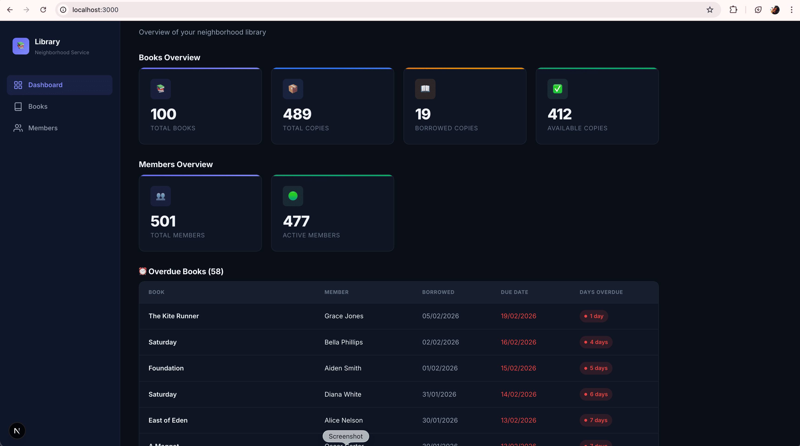
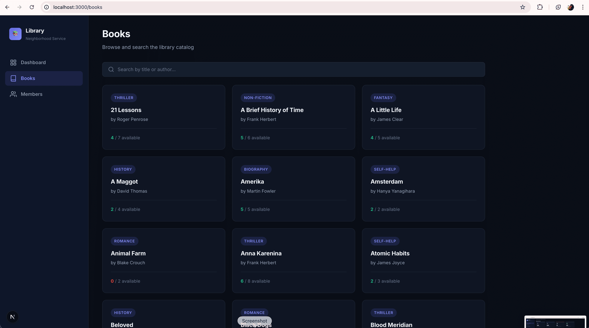
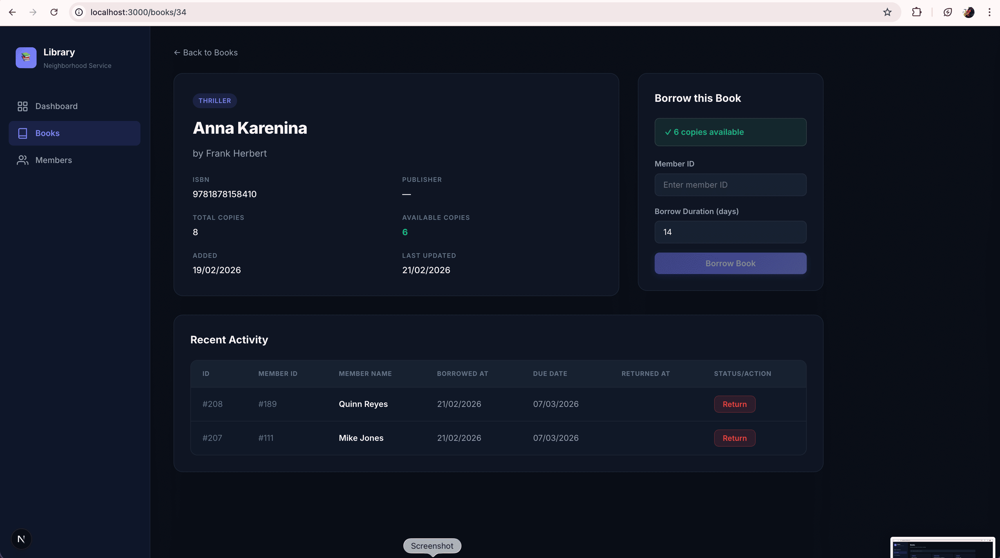
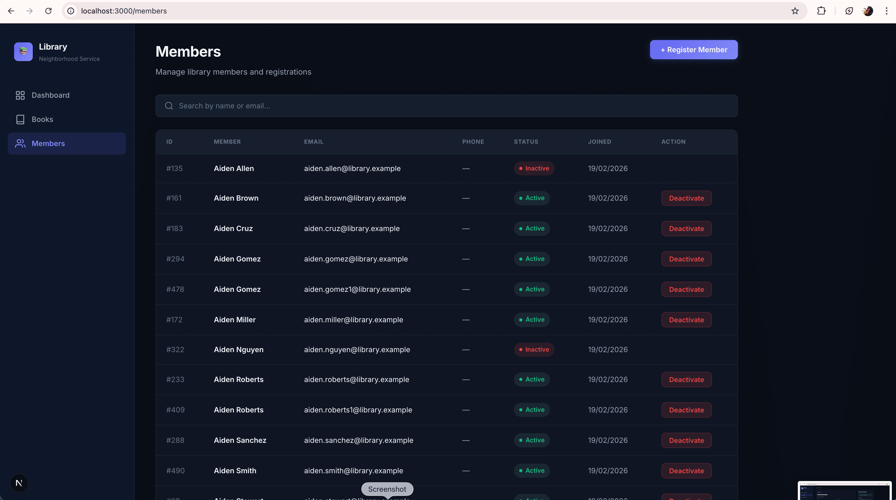
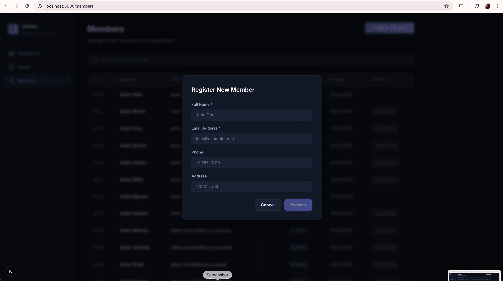

# 📚 Neighborhood Library Service

A full-stack application for managing a neighborhood library's books, members, and lending operations.

**Backend:** FastAPI · Tortoise ORM · PostgreSQL  
**Frontend:** Next.js (React) · TypeScript  
**Infrastructure:** Docker Compose

---

## How to Run

### Prerequisites

- [Docker](https://docs.docker.com/get-docker/) and [Docker Compose](https://docs.docker.com/compose/install/) installed on your machine
- Create in `.env` file at the project root (below is the sample provided below)
```
    POSTGRES_USER=library_user
    POSTGRES_PASSWORD=library_pass
    POSTGRES_DB=library_db
    DATABASE_URL=postgres://library_user:library_pass@db:5432/library_db
  ```
---

### Steps

```bash
# 1. Clone the repository
git clone <repository-url>
cd neighborhood-library-service

# 2. Start all services (PostgreSQL + Backend + Frontend)
docker compose up --build

# 3. (Optional) Seed sample data in a separate terminal 
# (Seeder will run automatically on first run)
docker compose exec backend python -m scripts.seed
```

That's it! Once the containers are running:

| URL | What you'll see |
|-----|-----------------|
| http://localhost:3000 | **Frontend** — Dashboard, Books, Members |
| http://localhost:8000/docs | **Swagger UI** — Interactive API docs |

To stop: `Ctrl+C` then `docker compose down`
To reset everything (including DB data): `docker compose down -v`

---

## Project Structure

```
neighborhood-library-service/
├── backend/
│   ├── app/
│   │   ├── main.py              # FastAPI entry point, CORS, router wiring
│   │   ├── database.py          # Tortoise ORM connection config
│   │   ├── core/
│   │   │   └── config.py        # Settings from environment variables
│   │   ├── models/              # Tortoise ORM models
│   │   │   ├── book.py          # Book entity
│   │   │   ├── member.py        # Member entity
│   │   │   └── borrow_record.py # BorrowRecord entity (FK → Book, Member)
│   │   ├── schemas/             # Pydantic request/response schemas
│   │   │   ├── book.py          # BookCreate, BookUpdate, BookResponse
│   │   │   ├── member.py        # MemberCreate, MemberUpdate, MemberResponse
│   │   │   └── borrow_record.py # BorrowRequest, BorrowRecordResponse
│   │   ├── repositories/        # Data access layer (async DB queries)
│   │   │   ├── book.py
│   │   │   ├── member.py
│   │   │   └── borrow_record.py
│   │   ├── services/            # Business logic layer
│   │   │   ├── book.py
│   │   │   ├── member.py
│   │   │   ├── borrow.py        # Borrow/return rules, validations
│   │   │   └── stats.py         # Aggregate statistics
│   │   └── api/v1/routes/       # HTTP route handlers
│   │       ├── books.py
│   │       ├── members.py
│   │       ├── borrow.py
│   │       └── stats.py
│   ├── scripts/
│   │   ├── start.sh             # Container entrypoint
│   │   └── seed.py              # Sample data seeder
│   ├── tests/
│   │   ├── unit/                # Unit tests (mocked repositories)
│   │   └── integration/         # Integration tests (real DB)
│   ├── pyproject.toml
│   └── Dockerfile
├── frontend/
│   ├── src/
│   │   ├── app/
│   │   │   ├── page.tsx         # Dashboard (stats overview)
│   │   │   ├── books/
│   │   │   │   ├── page.tsx     # Books list (search, pagination)
│   │   │   │   └── [id]/page.tsx # Book detail + borrow/return panel
│   │   │   ├── members/
│   │   │   │   └── page.tsx     # Members table + register + deactivate
│   │   │   ├── layout.tsx       # Root layout with sidebar
│   │   │   └── globals.css      # Design system (dark theme, glassmorphism)
│   │   ├── components/
│   │   │   ├── Sidebar.tsx
│   │   │   ├── StatsCard.tsx
│   │   │   └── BookCard.tsx
│   │   └── lib/
│   │       └── api.ts           # Typed API client
│   ├── next.config.ts
│   ├── package.json
│   └── Dockerfile
├── docker-compose.yml
├── .env
└── README.md
```

---

## Database Schema

Three normalized tables with foreign key relationships:

```
┌──────────────────┐     ┌──────────────────────┐     ┌──────────────────┐
│     books         │     │   borrow_records      │     │    members        │
├──────────────────┤     ├──────────────────────┤     ├──────────────────┤
│ id (PK)          │◄────│ book_id (FK)          │     │ id (PK)          │
│ title            │     │ member_id (FK)  ──────┼────►│ name             │
│ author           │     │ id (PK)              │     │ email (UNIQUE)   │
│ isbn (UNIQUE)    │     │ borrowed_at          │     │ phone            │
│ genre            │     │ due_date             │     │ address          │
│ publisher        │     │ returned_at          │     │ is_active        │
│ total_copies     │     │ status (ENUM)        │     │ created_at       │
│ available_copies │     │                      │     │ updated_at       │
│ created_at       │     └──────────────────────┘     └──────────────────┘
│ updated_at       │
└──────────────────┘

Status enum: BORROWED | RETURNED | OVERDUE
```

---

## API Endpoints

### Books (`/api/v1/books`)

| Method | Path | Description |
|--------|------|-------------|
| `POST` | `/api/v1/books/` | Create a new book |
| `GET` | `/api/v1/books/` | List/search books (supports `search`, `genre`, `page`, `size`) |
| `GET` | `/api/v1/books/{id}` | Get book details |
| `PATCH` | `/api/v1/books/{id}` | Update a book |
| `DELETE` | `/api/v1/books/{id}` | Delete a book |

### Members (`/api/v1/members`)

| Method | Path | Description |
|--------|------|-------------|
| `POST` | `/api/v1/members/` | Register a new member |
| `GET` | `/api/v1/members/` | List/search members (supports `search`, `is_active`, `page`, `size`) |
| `GET` | `/api/v1/members/{id}` | Get member details |
| `PATCH` | `/api/v1/members/{id}` | Update a member |
| `DELETE` | `/api/v1/members/{id}` | Deactivate (soft-delete) a member |

### Borrowing (`/api/v1/borrow`)

| Method | Path | Description |
|--------|------|-------------|
| `POST` | `/api/v1/borrow/` | Borrow a book |
| `POST` | `/api/v1/borrow/{id}/return` | Return a borrowed book |
| `GET` | `/api/v1/borrow/` | List borrow records (filter by `member_id`, `book_id`, `status`) |
| `GET` | `/api/v1/borrow/overdue` | List overdue books |
| `GET` | `/api/v1/borrow/member/{id}` | All currently borrowed books for a member |

### Stats (`/api/v1/stats`)

| Method | Path | Description |
|--------|------|-------------|
| `GET` | `/api/v1/stats/` | Aggregate library statistics |

---

## Frontend Pages

| Page | Route | Features |
|------|-------|----------|
| **Dashboard** | `/` | Stats cards grouped by Books, Members, and Alerts |
| **Books** | `/books` | Searchable, paginated book grid with genre badges |
| **Book Detail** | `/books/{id}` | Full metadata, borrow form, recent activity table with return action |
| **Members** | `/members` | Searchable member table, Register modal, Deactivate button |

---

## Architecture

The backend follows a **Route → Service → Repository** layered pattern:

```
HTTP Request
    │
    ▼
Routes (API layer)       ← Handles HTTP, validation, response formatting
    │
    ▼
Services (Business logic) ← Business rules, orchestration, error handling
    │
    ▼
Repositories (Data access) ← Database queries via Tortoise ORM
    │
    ▼
PostgreSQL
```

---

## Environment Variables

Defined in `.env` at the project root:

| Variable | Default | Description |
|----------|---------|-------------|
| `POSTGRES_USER` | `library_user` | PostgreSQL username |
| `POSTGRES_PASSWORD` | `library_pass` | PostgreSQL password |
| `POSTGRES_DB` | `library_db` | Database name |
| `DATABASE_URL` | *(auto-constructed)* | Full database connection URL |
| `DEFAULT_BORROW_DAYS` | `14` | Default lending period in days |

---

## Testing

### Run all tests

```bash
docker compose exec backend python -m pytest tests/ -v
```

### Test structure

| Directory | Type | Coverage |
|-----------|------|----------|
| `tests/unit/` | Unit tests | Service/repository logic with mocked dependencies |
| `tests/integration/` | Integration tests | Full API endpoint tests against real database |

### Test files

- `test_book_crud.py` — Book create, read, update, delete operations
- `test_member_crud.py` — Member registration, update, deactivation
- `test_borrow_crud.py` — Borrow, return, overdue, and business rule enforcement

---

## Development

### Stop services

```bash
docker compose down
```

### Stop and remove all data

```bash
docker compose down -v
```

### View logs

```bash
docker compose logs -f backend    # Backend logs
docker compose logs -f frontend   # Frontend logs
```

### Aerich Migrations (for schema changes)

```bash
# Initialize Aerich (first time only)
docker compose exec backend aerich init -t app.database.TORTOISE_ORM

# Create a migration
docker compose exec backend aerich migrate --name "description"

# Apply migrations
docker compose exec backend aerich upgrade
```

---

## Testing the API (Example Flow)

Open **Swagger UI** at http://localhost:8000/docs and follow this flow:

1. **Create a book** → `POST /api/v1/books/`
2. **Register a member** → `POST /api/v1/members/`
3. **Borrow the book** → `POST /api/v1/borrow/` *(provide book_id and member_id)*
4. **List borrowed books** → `GET /api/v1/borrow/member/{member_id}`
5. **Return the book** → `POST /api/v1/borrow/{record_id}/return`
6. **Check stats** → `GET /api/v1/stats/`

Or use **curl**:

```bash
# Create a book
curl -X POST http://localhost:8000/api/v1/books/ \
  -H "Content-Type: application/json" \
  -d '{"title": "The Great Gatsby", "author": "F. Scott Fitzgerald", "isbn": "9780743273565", "total_copies": 3}'

# Register a member
curl -X POST http://localhost:8000/api/v1/members/ \
  -H "Content-Type: application/json" \
  -d '{"name": "Jane Doe", "email": "jane@example.com", "phone": "+1-555-0100"}'

# Borrow a book
curl -X POST http://localhost:8000/api/v1/borrow/ \
  -H "Content-Type: application/json" \
  -d '{"book_id": 1, "member_id": 1}'

# Return a book
curl -X POST http://localhost:8000/api/v1/borrow/1/return
```

---

## Requirements Coverage

### Functional Requirements

| # | Requirement | Implementation |
|---|-------------|----------------|
| 1 | **Track Books** (title, author, etc.) | `Book` model with title, author, ISBN, genre, publisher, copy counts |
| 2 | **Track Members** (name, contact info, etc.) | `Member` model with name, email, phone, address, active status |
| 3 | **Track Borrowing/Returning** (who, what, when) | `BorrowRecord` model with book FK, member FK, dates, status enum |
| 4 | **Create/Update books and members** | Full CRUD endpoints for both (`POST`, `GET`, `PATCH`, `DELETE`) |
| 5 | **Record when a member borrows a book** | `POST /api/v1/borrow/` with business rule validation |
| 6 | **Record when a borrowed book is returned** | `POST /api/v1/borrow/{id}/return` updates status and restores copies |
| 7 | **Query/list borrowed books** | Filter by member, book, status; dedicated `/borrow/member/{id}` endpoint |

### Technical Requirements

| Requirement | Details |
|-------------|---------|
| **Python server** | FastAPI with async/await, Uvicorn |
| **REST API** | RESTful endpoints with proper HTTP methods and status codes |
| **PostgreSQL** | PostgreSQL 16 via Docker, Tortoise ORM (asyncpg driver) |
| **Database schema design** | 3 normalized tables with foreign keys and indexes |
| **Documentation / README** | This file — setup, run, test, and API reference |
| **Docker setup** | Single `docker compose up --build` starts everything |
| **Minimal Frontend (React/Next.js)** | Next.js App Router with Dashboard, Books, and Members pages |

### Optional / Bonus Features

| Feature | Details |
|---------|---------|
| **Overdue book handling** | Due dates tracked, `GET /borrow/overdue` endpoint, auto-marks OVERDUE status |
| **Error handling** | Custom `BorrowError` exceptions, HTTP 4xx responses with clear messages |
| **Input validation** | Pydantic schemas with `Field(...)` constraints (min/max length, email, etc.) |
| **Cannot borrow already-checked-out book** | Duplicate active borrow prevention per member+book pair |
| **Inactive member cannot borrow** | Business rule enforced in `BorrowService` |
| **Borrow limit per member** | Max 10 simultaneous borrows per member |
| **Copy tracking** | `available_copies` auto-decremented/incremented on borrow/return |
| **Paginated results** | All list endpoints support `page` and `size` query params |
| **Search** | Books searchable by title/author; Members searchable by name/email |
| **Seed data script** | `scripts/seed.py` populates sample books and members |
| **Automated tests** | Unit tests (3 files) + Integration tests (3 files) using pytest |
| **Stats dashboard** | `GET /api/v1/stats/` returns aggregate library metrics |

---

## Tech Stack

| Layer | Technology |
|-------|------------|
| Backend | FastAPI + Uvicorn (async Python) |
| ORM | Tortoise ORM (asyncpg) |
| Database | PostgreSQL 16 |
| Migrations | Aerich |
| Frontend | Next.js 15 (App Router), React 19, TypeScript |
| Containerization | Docker + Docker Compose |

---

## Screenshots


Home

Books

Book Detail

Members

Members Create



---
